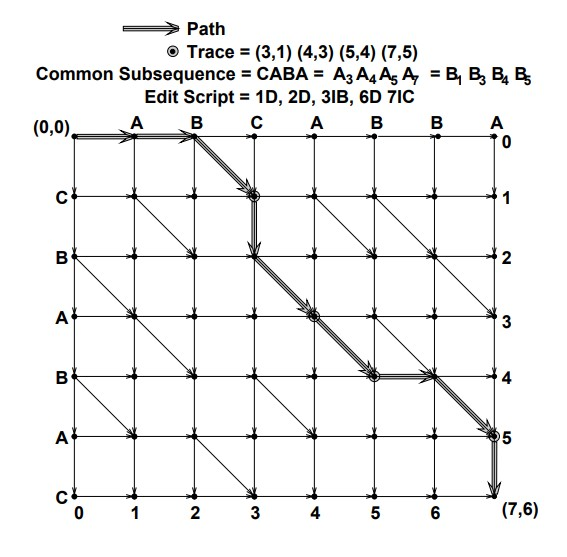

# Proyecto-2


#Implementacion

## VM: Manejador de Versiones

## Fuuuuu-sion!


El algoritmo de fusion usado es una implementacion del algoritmo de [Myers](https://neil.fraser.name/writing/diff/myers.pdf) (expresado en la Figura 2 del paper), con una pequeña variacion, la cual recuerda la accion realizada (insercion, eliminacion, ninguna), lo cual es mas simple que lo que sugiere el paper
(el cual trata de obtener la traza, y luego decidir si lo que se hizo fue una insercion o eliminacion).

El algoritmo de myers se basa en una idea muy simple, supongamos que tenemos dos secuencias: $A=abcabba$ y $B=cbabac$, para encontrar el script de edicion mas corto, construiremos un grid:



En donde cada arista vertical/horizontal significa tener que insertar/eliminar la letra para poder transformar un string en otro, y cada
arista diagonal simboliza que ambas letras son iguales, y por tanto
no necesitan modificacion.

Si pesamos las aristas verticales/horizontales con 1, y las diagonales
con 0, entonces el problema de encontrar el script de edicion mas
corto, se conviere en un problema de encontrar el costo minimo desde
la esquina inicial (string vacio) hasta la esquina inferior derecha
(string que fusionado).

La forma en que se encuentra este camino de costo minimo, es bastante similar a como se plantea dijkstra. Primero, te das cuenta que el grid se puede enumerar por sus diagonales, y que cada camino de costo $D$ debe terminar en una diagonal $\{-D,-D+2,\dots,D-2,D\}$.

Luego notas que todos los caminos de costo $D$, los puedes descomponer en un camino de costo $D-1$, seguido de una diagonal
(a la cual llaman snake), seguido de una arista vertical/horizontal, pero que adicionalmente, los caminos de costo $D$ que llegan mas a la derecha/mas hacia abajo se construyen precisamente a partir de los caminos de costo $D-1$ que llegan mas hacia la derecha/ mas hacia abajo. Es decir, cumplen optimalidad!

Finalmente, tenemos que el camino desde $(0,0)$ a $(N,M)$ es justamente el camino que llega mas hacia la derecha y mas abajo del grid! por lo tanto podemos utilizar una estrategia greedy, apoyandonos en las diagonales para generar nuestros candidatos.

Finalmente, nuestra implementacion en C++ del algoritmo mencionado (el cual al ser una traduccion directa, posee complejidad $O((M+N)D)$ en donde $D$ es la longitud del camino de costo minimo, para mas informacion vease el paper c: ):

```c++
// We only have 3 options for the edit script
enum class Action { INSERT, DELETE, NOTHING };

vector<pair<Action,char>> diffMyers(string v1, string v2){
  // Myers algorithm strings starts at 1.

  // it's just easier to manage a map because of the range. After testing
  // we can change this to array and do a traslation.
  map<int,int> V; // V : Array [-MAX..MAX]
  // it's easier to keep track of the traces than reconstructing them using
  // the V vector.
  map<int,vector<pair<Action,char>>> traces;

  V[1]  = 0;
  traces[1] = vector<pair<Action,char>>();

  const int M = v1.length();
  const int N = v2.length();
  const int MAX   = M + N + 1;

  bool chooseInsert;
  int x,y;
  vector<pair<Action,char>> trace;

  for (int D = 0; D < MAX; D++)
  {
    for (int k = -D; k < D+1; k+=2)
    {
      chooseInsert = k == -D || (k != D && V[k-1] < V[k+1]);
      if (chooseInsert){
        x = V[k+1];
        trace = traces[k+1];
      } else{
        x = V[k-1] + 1;
        trace = traces[k-1];
      }

      y = x - k;

      // expand a D-1 path.
      if (1 <= y && y <= N && chooseInsert){
        trace.push_back(make_pair(Action::INSERT,v2[y - 1]));
      } else if (1 <= x && x <= M)
      {
        trace.push_back(make_pair(Action::DELETE,v1[x - 1]));
      }

      // and then expand the SNAKEEEEEEEEEEEEEEEEEEEEEEEEEEEEEE.
      while (x < M && y < N && v1[(x+1) - 1] == v2[(y+1) - 1])
      {
        x++;
        y++;
        trace.push_back(make_pair(Action::NOTHING,v1[x - 1]));
      }

      // did we arrived at the end? return the trace.
      if (x >= M && y >= N){
        return trace;
      } else{
        V[k]  = x;
        traces[k] = trace;
      }
    }
  }
  
}
```

## FS: El sistema de archivos

Para el sistema de archivos, decidimos mantenerlo simple: este es modelado como un Rose Tree que alberga o nodos no terminales (folders) o nodos terminales (files), junto a un manejador de versiones opcional:


```c++
struct FS{
  optional<versionManager> vm;
  map<string,variant<FileSystem*,File>> succs;
}
```

Lo que fuerza a propagar las actualizaciones potencialmente hasta la raiz, sin embargo, como la profundidad de los sistemas de archivos no suele ser extensa, consideramos que es un buen tradeoff.

